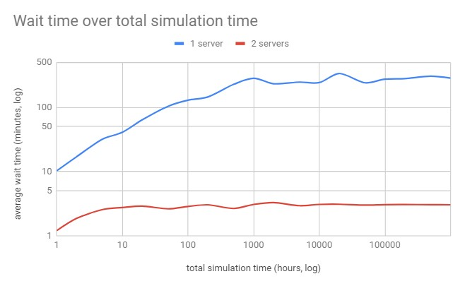

# Queue Simulation

This repository attempts to perform simulation explained by [this thread](https://twitter.com/ben_golub/status/1448046115023118340).

> If customers take on avg 10 minutes to serve and arrive randomly at a rate of 5.8 per hour, then with one bank teller working, expected wait is 5 hours. With two tellers, 3 minutes.

The finding is that the expected wait time 5 hours only occurs when we run the system *indefinitely*. The simulation shows that it converges at around 1,000 simulation hours. When the simulation [runs for a more realistic time of 8 hours](result_8_hours_1_server.txt) (i.e. business hours per day), **the average wait time becomes closer to one hour**. Much smaller, but still significant nonetheless.

In [the code](queue.go), play around with the total time, number of servers, customer and server rates, and the RNG seed to simulate different scenarios.
